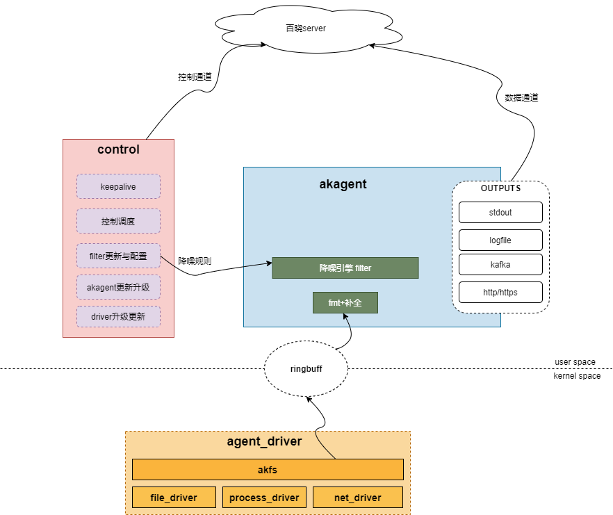

# 百晓

## 百晓HIDS
**百晓HIDS**是由百晓安全团队开发维护的主机行为监测系统。整个系统分为`服务端server`与`客户端agent`。集异常检测、监控管理为一体，拥有容器监控、异常行为发现、内核级恶意行为阻断、高级分析等功能，可从多个维度行为信息中发现入侵行为。

**客户端agent**主要负责采集监控数据，数据降噪以及数据上报，同时支持一些异常行为的`内核级阻断`操作：例如恶意进程创建，非法外联。主要分为`用户层服务模块akagent`以及`kernel_driver`

**kernel_driver**基于ftrace开发(3.x版本:ftrace, 2.x版本:inlinehook, 4.x版本:ebpf)，并根据`进程行为`，`文件变动`以及`主机网络事件`分别实现三个`独立driver`模块，三大模块基于**akfs**自研文件系统运行。

- **process_driver**:  采集进程fork、exec、exit、kill等信息.
- **file_driver**: 监控输出文件创建、写入、权限变更、删除、移动、映射、chroot等事件.
- **net_driver**: 监控tcp请求建连、tcp接受建连、tcp断开连接、DNS请求等主机网络事件.
- akfs_driver：`山竹`开发实现的一个文件系统，提供基础能力支持。

## 百晓HIDS架构

#### 																							设备侧架构图

## 说明文档

### 配置文档

- [事件规则](./配置文档/事件规则说明.md)
- [降噪规则](./配置文档/降噪规则说明.md)
- [akagent配置](./配置文档/akagent配置.md)

### 接口文档

- [进程事件](./接口文档/进程事件内容说明.md)

- [文件事件](./接口文档/文件事件内容说明.md)
- [网络事件](./接口文档/网络事件内容说明.md)